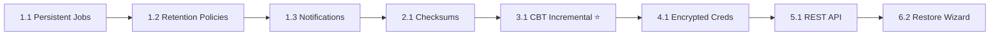

# vSphere Backup Manager — Enterprise Roadmap

## Current State ✅

The backup engine is working. It connects to vCenter, creates crash-consistent snapshots, downloads full VMDK flat disk data and VMX configs, and runs scheduled recurring jobs — all accessible via a modern Flask web UI.

---

## Priority 1 — Core Reliability & Persistence

These are **non-negotiable** for a production system. Without them, the tool is still a "hobby project."

### 1.1 — Persistent Job Store

> **Why:** Currently everything is in RAM. A PM2 restart wipes all job history and kills all schedules.

- Save `jobs` dict to `jobs.json` on every state change (create, status update, completion)
- On app startup, load `jobs.json` and re-register all `scheduled` jobs into APScheduler
- Impact: **Zero job loss across restarts**

### 1.2 — Backup Retention Policies

> **Why:** Without retention, the backup disk fills up forever.

- Per-job retention rules: keep last **N** full backups, or keep backups no older than **X days**
- Auto-purge old backup directories after a new backup completes successfully
- Show retention info and countdown on the Jobs dashboard
- Impact: **Prevents disk exhaustion**, critical for unattended operation

### 1.3 — Email / Webhook Notifications

> **Why:** Admins can't watch a dashboard 24/7.

- Send email (SMTP) on: backup success, failure, or warning
- Send webhook (Slack, Teams, generic HTTP) on job completion
- Configurable per-job or globally
- Impact: **Instant alerting** on failures

---

## Priority 2 — Backup Integrity & Verification

A backup that can't be verified is a liability, not an asset.

### 2.1 — Checksum Verification

> **Why:** Bit-rot, network corruption, or a partial write can silently corrupt a backup.

- After each file download, compute **SHA-256** of the downloaded file
- Store checksums in a `manifest.json` next to each backup
- Optionally verify checksums before an upload or restore

### 2.2 — Backup Manifest & Catalog

> **Why:** You need a machine-readable record of every backup for audit and restore.

Each backup produces a `manifest.json`:

```json
{
  "job_id": "...",
  "vm_name": "Nakivo",
  "started": "2026-06-22T01:52:00Z",
  "finished": "2026-06-22T03:10:44Z",
  "vcenter": "vcsa.noc.pens.ac.id",
  "snapshot": "backup-1782067446",
  "files": [
    { "path": "Nakivo/Nakivo.vmdk", "size_bytes": 491, "sha256": "..." },
    {
      "path": "Nakivo/Nakivo-flat.vmdk",
      "size_bytes": 17179869184,
      "sha256": "..."
    },
    { "path": "Nakivo/Nakivo.vmx", "size_bytes": 3065, "sha256": "..." }
  ]
}
```

### 2.3 — Test Restore (Dry-Run)

> **Why:** The only way to know a backup works is to try restoring it.

- "Verify Backup" button in the UI
- Checks: manifest exists, all files present, SHA-256 matches, disk size matches vCenter
- Optionally: power on the VM in an isolated network (advanced)

---

## Priority 3 — Backup Strategies (Storage Efficiency)

### 3.1 — Incremental / Changed Block Tracking (CBT)

> **Why:** Downloading a full 16 GB disk every night is inefficient. CBT lets you only transfer **changed blocks**.

- Enable VMware CBT (`changeTrackingEnabled`) on the VM
- Use `vim.VirtualDisk.QueryChangedDiskAreas()` to get only changed extents
- Download only the changed byte ranges from the flat VMDK (HTTP Range requests)
- Store deltas alongside the full base backup
- Impact: **80–99% reduction** in daily backup transfer size

> [!IMPORTANT]
> This is the #1 differentiator between amateur and enterprise backup tools.

### 3.2 — Deduplication

> **Why:** Multiple VMs often share identical OS blocks.

- Block-level deduplication using content hashing (e.g., SHA-256 per 4 MB block)
- Store a deduplicated block store; backups reference blocks by hash
- Tools: integrate with `zfs send` (if on ZFS) or implement a simple local content-addressable store

### 3.3 — Compression

> Already implemented (`zstd`), but integrate tighter with CBT deltas for per-block compression.

---

## Priority 4 — Security & Multi-User

### 4.1 — Encrypted Credential Storage

> **Why:** Currently vCenter passwords are in Flask signed cookies (not encrypted).

- Store credentials in server-side encrypted store (e.g., using `cryptography.fernet`)
- Never transmit plaintext passwords to frontend JavaScript
- Support environment variable injection (`VCENTER_PASSWORD`)

### 4.2 — Role-Based Access Control (RBAC)

> **Why:** In an enterprise, not everyone should have the same access.

| Role     | Permissions                                                      |
| -------- | ---------------------------------------------------------------- |
| Admin    | Full access — create/delete jobs, manage schedules, view all VMs |
| Operator | Start/stop jobs, view logs, cannot change schedules              |
| Viewer   | Read-only dashboard access                                       |

- Local user accounts stored in a SQLite database with bcrypt-hashed passwords
- Simple session-based auth or JWT tokens

### 4.3 — Audit Log

> **Why:** Who ran a backup? Who deleted a job? Essential for compliance.

- Persistent append-only audit log
- Records: user, action, VM, timestamp, result
- Viewable in the UI with filtering

---

## Priority 5 — Operations & Monitoring

### 5.1 — REST API

> **Why:** Integrate with Ansible, Terraform, CI/CD pipelines, or your own monitoring system.

Expose a full REST API:

```
GET  /api/v1/jobs              — list all jobs
POST /api/v1/jobs              — create job
GET  /api/v1/jobs/{id}         — job status + progress
POST /api/v1/jobs/{id}/cancel  — cancel job
GET  /api/v1/vms               — list VMs
GET  /api/v1/backups           — list completed backups with manifests
POST /api/v1/backups/{id}/verify — trigger checksum verify
```

Include API key authentication (`X-API-Key` header).

### 5.2 — Metrics & Dashboard (Prometheus/Grafana)

> **Why:** At-a-glance health visibility across all backup jobs.

- Expose a `/metrics` endpoint (Prometheus format)
- Metrics: `backup_duration_seconds`, `backup_size_bytes`, `backup_success_total`, `backup_failure_total`
- Build a Grafana dashboard for the backup operations team

### 5.3 — Multi-vCenter Support

> **Why:** Enterprises run multiple vCenter clusters.

- Support multiple saved vCenter connections (not just session-based)
- Jobs can target VMs across different vCenter instances
- Unified jobs dashboard across all vCenters

### 5.4 — Storage Backend Plugins

> **Why:** Not everyone stores backups on local NFS.

| Backend          | Use Case                          |
| ---------------- | --------------------------------- |
| NFS (current)    | On-prem NAS                       |
| S3 / MinIO       | Object storage (on-prem or cloud) |
| Azure Blob       | Azure-hosted environments         |
| Rclone (generic) | 60+ cloud providers               |

---

## Priority 6 — Disaster Recovery Features

### 6.1 — Instant VM Recovery

> **Why:** RTO (Recovery Time Objective) of minutes, not hours.

- Register the downloaded VMDK directly back to vCenter without full copy
- Use `RegisterVM_Task` on the downloaded `.vmx` pointing to the backup directory
- If backup is on NFS, this is near-instant (no copy needed)

### 6.2 — Restore Wizard

> Add a "Restore" tab to the UI

- Browse backup catalog → select VM → select restore point → choose target host/datastore
- Options: restore in-place (overwrite) or restore as new VM (clone)
- Track restore progress like backup progress

### 6.3 — Off-site Replication

> **Why:** 3-2-1 backup rule: 3 copies, 2 different media, **1 offsite**.

- After backup completes, replicate to a secondary NFS, S3, or SFTP target
- Run replication in parallel or sequential
- Alert if replication fails even if backup succeeded

---

## Priority 7 — UI/UX Polish

### 7.1 — Backup Calendar View

- Visual calendar showing which VMs were backed up on which days
- Color-coded: green = success, red = failure, yellow = warning

### 7.2 — Storage Analytics

- Pie chart / bar chart: backup size per VM, storage growth over time
- Alert when NFS mount is above 80% full

### 7.3 — Live Progress Streaming (SSE/WebSocket)

> **Why:** Currently the log page requires polling. Server-Sent Events provide true live streaming.

- Replace AJAX polling with `EventSource` (SSE) for real-time log updates
- Show a live progress bar with phase labels: Connecting → Snapshot → Downloading → Compressing → Done

---

## Recommended Implementation Order



| Phase       | Features        | Effort   | Impact                                |
| ----------- | --------------- | -------- | ------------------------------------- |
| **Phase 1** | 1.1 + 1.2 + 1.3 | ~2 days  | Survives restarts, alerts on failures |
| **Phase 2** | 2.1 + 2.2 + 5.1 | ~3 days  | Trusted backups, API integration      |
| **Phase 3** | 3.1 (CBT)       | ~1 week  | Game-changer: 90% less bandwidth      |
| **Phase 4** | 4.1 + 4.2 + 4.3 | ~1 week  | Enterprise security & compliance      |
| **Phase 5** | 6.2 + 5.4 + 5.2 | ~2 weeks | Full DR capability                    |
